# My ZMK config for the MoErgo Glove80

> NOTE (MISE override): This repository includes a `mise.toml` to provide a local, reproducible
> workflow for drawing keymap images without depending on system package managers. Use
> `mise run setup` to create the `.venv` and install the required `keymap-drawer` version, then
> `mise run draw` to generate the SVG layer images. Tested with MacOS.

Based on [MoErgo's template](https://github.com/moergo-sc/glove80-zmk-config) and [Gaétan Lepage's flake](https://github.com/GaetanLepage/glove80-zmk-config).

This repo contains the current config for my Glove80 keyboard.
The keymap was initially built using MoErgo's [Layout Editor](https://my.glove80.com),
however it is now maintained using [Keymap Editor] with occasional manual tweaking.

The keyboard firmware can be built locally using `nix`, which is also used for [automatic builds].

[Keymap Drawer] is used to render images of each layer (see below).

## Layers

The images below are rendered in the build order produced by the keymap-drawer output. Per-finger layers (e.g. `LeftIndex`, `RightPinky`) are omitted for brevity — see the `img/` directory for those.

 
## Setup

### Flashing Firmware

Before flashing, ensure `udisks2` is setup and enabled so that the keyboard can mount its bootloader storage device.

- [`services.udisks2.enable`](https://nixos.org/manual/nixos/stable/options#opt-services.udisks2.enable) NixOS option
- `systemctl status udisks2.service`
- `udisksctl status`

#### Flashing automatically

The easiest way to flash the firmware is using `nix run`.

- `cd` into the project root
- Connect the **right** half (in bootloader mode)
- Run `nix run`
- Connect the **left** half (in bootloader mode)
- Run `nix run`
- Done!

#### Flashing manually

You can also manually copy the `uf2` firmware file to the keyboard.

The firmware can be built locally using `nix build` and will be written to `./result/glove80.uf2`.
Alternatively, the firmware can be downloaded from [GitHub Actions][automatic builds]'s artifacts.

Connect the keyboard half in bootloader mode, then copy the firmware file into the keyboard's USB storage.
The keyboard will unmount when it has finished flashing.

### Booting into bootloader mode

See the [user guide](https://docs.moergo.com/glove80-user-guide/customizing-key-layout/#putting-glove80-into-bootloader-for-firmware-loading) for more info.

- Hold the `C6 R6` key (extreme bottom corner)
- Also hold the `C3 R2` key (middle-finger; Colemak `F` or `U`, Qwerty `E` or `I`)
- Power on the keyboard

#### You can tell if a Glove80 half is in bootloader mode using the red LED next to the power switch:

- Slow LED: in bootloader mode and connected via USB.
- Fast LED: in bootloader mode but there is no USB connection.
- Solid or no LED: not in bootloader mode.

### Factory reset

See the [user guide](https://docs.moergo.com/glove80-user-guide/troubleshooting/#configuration-factory-reset-and-re-pairing-left-and-right-halves) for more info.

Similar to booting into bootloader mode, but use `R2` (numrow) instead of `R3`. Hold for ~5s powered on, before powering off again.

Note, the reset will not affect the saved keymap. Instead it wipes things like Bluetooth devices.

To re-pair the two halves: first power both on at the same time, then toggle RGB on/off with (Colemak) `Magic`+`B` or (Qwerty) `Magic`+`T`.

### Bluetooth

See the [user guide](https://docs.moergo.com/glove80-user-guide/operating-glove80-wirelessly) for more info.

#### Status

When tapping the `Magic` key, status indicators will appear on the Bluetooth keys.

<!-- Catppuccin themed "LED indicator" bullet points 😅 -->

  
  <strong>Connected</strong> (in use)
   
  
  <strong>Connected</strong> (not in use)
   
  
  <strong>Paired</strong> (not connected)
   
  
  <strong>Not paired</strong>

#### Pairing

- First ensure the profile is unpaired (white status LED)
- Select the profile
- Pair using the host device's interface

#### Unpairing

Unpair the selected Bluetooth profile using the `BT_Clear` key (see [magic layer] above). Alternatively unpair all devices using `BT_Clear_All`.

## Resources
- [@nickcoutsos]'s [Keymap Editor] ([webapp](https://nickcoutsos.github.io/keymap-editor)).
- [@caksoylar]'s [Keymap Drawer].

- [Glove80 User Guide](https://docs.moergo.com/glove80-user-guide/).
- [Glove80 Troubleshooting](https://docs.moergo.com/troubleshooting-faqs/).
- MoErgo's [Glove80 Support](https://moergo.com/glove80-support) page.
- MoErgo's [Discord Server](https://moergo.com/discord).

- [ZMK Documentation](https://zmk.dev/docs).
- ZMK's [Discord Server](https://discord.gg/8cfMkQksSB).

- MoErgo's [ZMK Distribution](https://github.com/moergo-sc/zmk).

[magic layer]: #moergos-magic-layer
[automatic builds]: https://github.com/MattSturgeon/glove80-config/actions/workflows/build.yml
[@nickcoutsos]: https://github.com/nickcoutsos
[@caksoylar]: https://github.com/caksoylar
[Keymap Editor]: https://github.com/nickcoutsos/keymap-editor
[Keymap Drawer]: https://github.com/caksoylar/keymap-drawer
